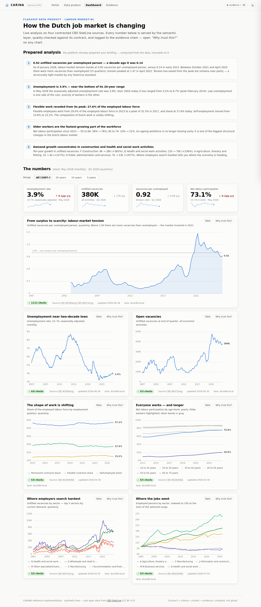
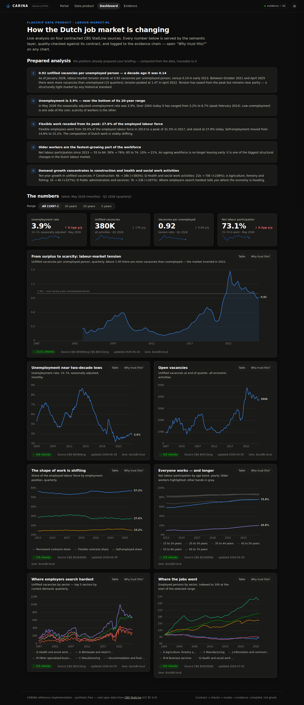
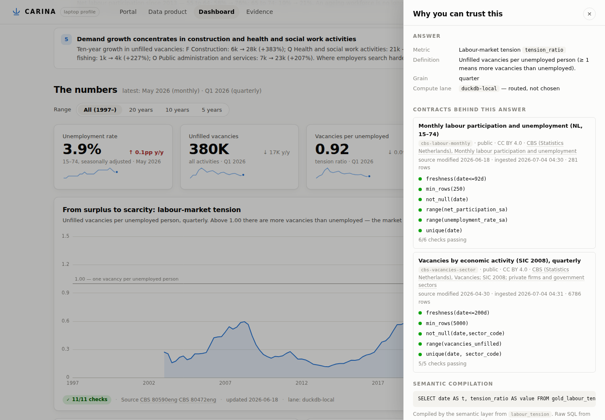
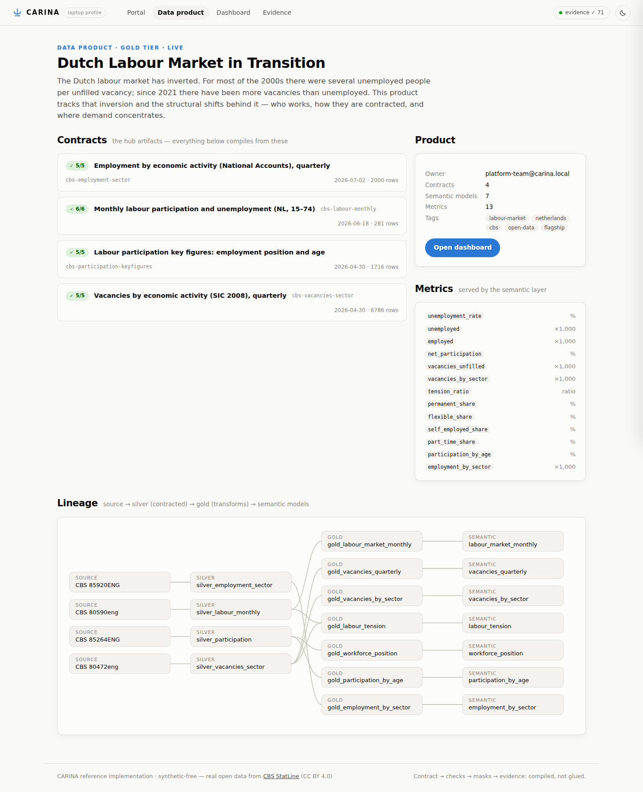
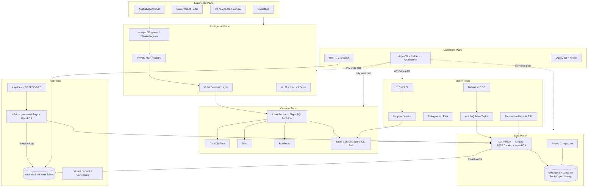

# CARINA — The Futuristic Data & Analytics Platform

> **Declare the *what*. Prove the *why*. The platform handles the *how* — and has already prepared your analysis.**

**CARINA** is the design for a next-generation, Kubernetes-native, open-source-first, EU-sovereign data & analytics platform — the successor to the [Open Data & Analytics Platform (ODAP)](https://github.com/karelgo/open-data-analytics-platform). *Carina* is the keel of the old ship constellation Argo Navis: the load-bearing spine on which the whole vessel is built. In this platform the keel is the **contract-bearing data product** — one Git-versioned contract file from which everything else compiles.

This repository contains both the **master plan** (architecture, component selection, governance model, AI-native operation, persona journeys, roadmap, ADRs) and a **working reference implementation** — the CARINA laptop profile — with a flagship data product analyzing **how the Dutch job market is changing**, built on live open data from CBS (Statistics Netherlands).

---

## 🚢 The Reference Implementation (runs on your laptop)

> **▶ View it live:** [CARINA — the Dutch job market, on the web](https://claude.ai/code/artifact/20b2ac3c-67ce-4d46-b8a6-914ea71139fe) — a fully-interactive static export (dashboard, trust drawers, product page, and the evidence chain re-hashing itself in your browser). Rebuild it yourself with `python scripts/build_static.py` → [`dist/index.html`](dist/index.html), a single self-contained file with no backend.


A single-node embodiment of the design: the data contract is the hub artifact, DuckDB is the compute lane, quality checks are **compiled from contracts** (never handwritten), every platform action lands in a **hash-chained evidence log**, and all consumption — the dashboard included — goes through a **governed semantic layer**. No raw SQL from consumers, ever.

```bash
# Python 3.11+ required
python -m venv .venv && . .venv/bin/activate
pip install -e .

carina run     # compile contracts + ingest 5 live CBS sources → bronze/silver/gold (WAP) + checks
carina serve   # portal + dashboard + evidence explorer on http://127.0.0.1:8899

# Phase 1 — KEEL verbs:
carina compile --check                      # CI gate: compiled artifacts must match contracts
carina create data-product my-product      # golden path: scaffold → live, measured
carina parity gold_a gold_b --key date     # dual-run migration gate with green-streak tracking
carina lanes                                # compute-lane router state
carina publish                              # export as Apache Iceberg tables, parity-verified
carina catalog status                       # what the catalog (Lakekeeper or local) serves
```

| | |
|---|---|
|  |  |
|  |  |

### The flagship use case: the Dutch job market in transition

Four contracted [CBS StatLine](https://opendata.cbs.nl) open-data sources (CC BY 4.0) feed one data product, [`products/labour-market-nl`](products/labour-market-nl):

| Contract | CBS dataset | What it contributes |
|---|---|---|
| `cbs-labour-monthly` | [80590eng](https://opendata.cbs.nl/statline/#/CBS/en/dataset/80590eng) | Monthly unemployment & participation, 2003–today |
| `cbs-vacancies-sector` | [80472eng](https://opendata.cbs.nl/statline/#/CBS/en/dataset/80472eng) | Quarterly vacancies by SIC 2008 sector, 1997–today |
| `cbs-participation-keyfigures` | [85264ENG](https://opendata.cbs.nl/statline/#/CBS/en/dataset/85264ENG) | Permanent / flexible / self-employed composition; participation by age |
| `cbs-employment-sector` | [85920ENG](https://opendata.cbs.nl/statline/#/CBS/en/dataset/85920ENG) | Employment by sector (National Accounts), 1995–today |

The dashboard's **prepared analysis** is computed from the data (deterministically — the laptop stand-in for the Analyst agent) and finds the story: labour-market tension went from **0.14 vacancies per unemployed person (2013) to a peak of 1.47 (2022)**; the market has been near or above parity since 2021; flexible work **peaked in 2017 and is receding**; participation of 55–64-year-olds rose from **58% to 76%** since 2013; and vacancy growth concentrates in **construction and health care**. Every chart carries a *"Why trust this?"* panel: the contracts behind it, their latest quality-check results, source freshness, the compiled SQL, and the evidence-chain head.

### What of CARINA is real here

| CARINA concept | Laptop-profile implementation |
|---|---|
| Contract as hub artifact (ADR-0011) | ODCS-flavored YAML in `products/*/contracts/` compiles the ingest filter, silver DDL, and quality checks |
| **Contract compiler v1** (Phase 1) | `carina compile` → silver DDL, checks SQL, **generated OPA Rego**, **OpenFGA tuples**, **catalog entry** per contract, committed under `products/*/compiled/`; `--check` is the CI drift gate |
| Quality compiled, never handwritten | `carina check` — checks generated from contract `quality:` blocks, results in DuckDB + evidence |
| **Write–Audit–Publish** (ADR-0005) | Gold transforms stage in a `wap` schema, compiled audits gate the publish; red audits leave production untouched |
| Evidence plane (ADR-0010) | Append-only SHA-256 hash chain over every ingest/transform/check/query; verified live in the UI |
| Semantic layer as only path (ADR-0008) | `semantic/metrics.yaml` → compiled SQL with provenance; the UI never sends SQL |
| **Lane routing v1** (ADR-0004) | A real router on every semantic query: `duckdb-local` + a `trino` seam (`CARINA_TRINO_DSN`), estimate-based escalation, full routing decision in provenance |
| **Golden path, measured** | `carina create data-product` scaffold → first green run records `golden_path.ship`; **`wages-nl` shipped in 4.6 min** against the 60-min KEEL target |
| **Migration parity gate** | `carina parity a b --key …` — row-level dual-run diffs with the 30-day green streak computed from the evidence chain |
| **Iceberg warehouse + catalog seam** (ADR-0001/0002) | `carina publish` writes real Apache Iceberg tables (local SQL catalog, or **Lakekeeper** via `CARINA_CATALOG_URI`), contract metadata in table properties, every publish round-trip parity-verified |
| Experience plane | Portal, product page with lineage DAG, flagship dashboard, evidence explorer; light + dark; table-view twin on every chart |

`src/carina/` is the platform (~2,000 lines of Python, 36 tests), `products/` holds two live products (`labour-market-nl`, `wages-nl`), `src/carina/ui/` is the portal (no build step; ECharts vendored). Phase 1 build status: [docs/keel-status.md](docs/keel-status.md).

---

---

## Why CARINA

ODAP proved that a compliant, open-source lakehouse on Kubernetes is possible. It also exposed the limits of the 2022-era blueprint: a passive Hive Metastore, a JVM-heavy always-on stack, streaming templates that stayed disabled, AI tooling bolted on at the edge, a portal made of iframes, and governance held together by custom glue code.

CARINA inverts each of those:

| Where ODAP… | CARINA… |
|---|---|
| wrote **glue code** | **compiles specs** — one data contract generates checks, DDL, masks, policies, catalog entries, and the product page |
| ran a **JVM by default** | runs a **protocol with a Rust/Go engine behind it** — JVM only where irreplaceable |
| treated the catalog as a **phonebook** | makes the catalog the **border control** — credential-vending, policy-enforcing, event-emitting |
| **bolted AI on** at the edge | lets **agents in the front door** — same badge, same policies, same audit trail as humans |
| documented compliance | **generates evidence by construction** — hash-chained audit tables, erasure with certificates |
| asked users to pick engines | routes every query invisibly — **nobody chooses an engine** |

## The Five Design Commitments

1. **The contract is the keel.** Every data product is declared in an [ODCS 3.1](https://bitol.io/) contract + ODPS descriptor. No contract, no deployment. From that one YAML file the platform compiles quality checks, DDL, schema-registry enforcement, row/column masks, access relationships, catalog metadata, retention & tiering, semantic-model stubs, incident routing, and the marketplace page.
2. **Specs over glue; protocols over engines.** The connective tissue is deliberately few and boring: Iceberg REST Catalog, Arrow / ADBC / Flight SQL / Substrait / Spark Connect, OIDC + SPIFFE, OpenLineage + CloudEvents + OTLP, and MCP. Engines are replaceable behind these seams.
3. **Agents are the fifth persona.** Three shipped AI agents — **Analyst**, **Engineer**, **Steward** — work alongside data engineers, analysts, scientists, and business users, under identical identity, policy, and audit. Raw text-to-SQL is banned; all AI access to data is grounded in the governed semantic layer.
4. **Sovereignty as architecture.** The infrastructure contract is "any S3 API + any CNCF Kubernetes." Fully deployable on EU providers or on-prem, with sovereign LLM inference. Designed assuming the EU–US Data Privacy Framework falls.
5. **Every claim of joy has a number.** A governed data product ships in **under 60 minutes**. A full local build runs in **seconds** on a laptop. A business user gets a decision-grade, lineage-traceable answer in **under 30 seconds**. Time-to-value is a tracked platform SLO.

## Architecture at a Glance



**Seven planes, one keel:** the [Data](docs/architecture.md#1-data-plane), [Compute](docs/architecture.md#2-compute-plane), [Motion](docs/architecture.md#3-motion-plane), [Intelligence](docs/architecture.md#4-intelligence-plane), [Trust](docs/architecture.md#5-trust-plane), [Experience](docs/architecture.md#6-experience-plane), and [Operations](docs/architecture.md#7-operations-plane) planes all attach to the data-product contract and compose over five shared protocols. Full detail in [docs/architecture.md](docs/architecture.md).

## Headline Choices

| Slot | Choice | One-line why |
|---|---|---|
| Table format | **Apache Iceberg v3** (+ **Lance** for AI/multimodal) | Ecosystem-neutral ASF format; row lineage & deletion vectors; Lance covers embeddings/training data |
| Catalog & control point | **Lakekeeper** (Iceberg REST Catalog, Rust) | Credential vending, OpenFGA authz, CloudEvents audit — the catalog becomes border control (Polaris as drilled fallback) |
| Object storage | **Rook-Ceph** (prod) / **Garage** (laptop/edge) | MinIO's open-source edition was archived in 2026; Ceph is the battle-tested LGPL choice |
| Compute | **DuckDB-first four lanes** behind a **Lane Router**: DuckDB → Trino → StarRocks → Spark Connect (Spark 4.x + Gluten/Velox, Sail pilot) | Scale-to-zero default, transparent escalation; nobody chooses an engine |
| Streaming | **Debezium → AutoMQ** (diskless Kafka, Table Topics → Iceberg) + **RisingWave** / **Flink** | S3 is the only state; streams land in the lakehouse without a copy job |
| SaaS ingestion | **dlt** scaffolded into the golden path | The long tail of Salesforce/Stripe/GA4-class sources, contract-governed |
| Reverse ETL | **Multiwoven** on contract-declared output ports | Governed activation back to CRMs and ad platforms, masks applied outbound |
| Transformation | **SQLMesh + SQLGlot + Recce**, Write-Audit-Publish on Iceberg branches | Virtual per-PR environments, column-level lineage, merge-blocking data diffs |
| Orchestration | **Dagster** (+ **Kestra** for platform automation) | Asset-oriented model matches data products; Airflow retired |
| Semantic layer | **Cube** + MetricFlow YAML + OSI interchange | One metric truth for BI, SQL, and agents — the only AI path to data |
| AI substrate | **MCP everywhere**, **LangGraph** agents, **vLLM + llm-d + KServe** with EU-usable open weights | Sovereign inference; agents governed like humans |
| Identity & policy | **Keycloak ⊕ SPIFFE/SPIRE ⊕ OpenFGA ⊕ OPA** (Rego generated from contracts) | One identity fabric for humans, workloads, and agents |
| Evidence | **Hash-chained Iceberg audit tables** (the one big bespoke build) | GDPR/NIS2/AI-Act evidence is a continuous query, not a project |
| GitOps & infra | **Argo CD** (only write path), **Crossplane**, **vCluster**, **Kueue/DRA + Karpenter + KEDA** | The platform state is a Git repository; agents contribute via PRs |
| Observability | **OpenTelemetry + eBPF → ClickStack**, **OpenCost + Kepler** | One SQL-queryable signal store; cost and carbon as governed metrics |

The full registry — every component, its role, and what it replaced from ODAP — is in [docs/components.md](docs/components.md).

## What It Feels Like

- **Data engineer:** `carina create data-product orders-eu --source postgres-cdc --source stripe` scaffolds contract, pipelines, transformations, semantic stub, and product page; `carina run` builds the whole project locally on DuckDB in seconds; production before stand-up. ([full journey](docs/personas.md))
- **Analyst:** adds a metric to versioned YAML, sees exactly which dashboards shift before merging, and the metric is identical in Rill, Evidence, SQL, and chat.
- **Data scientist:** a GPU workspace in under 5 minutes without a ticket; an instant **synthetic-data twin** while sensitive-data approval is pending.
- **Business user:** asks a question in plain language, gets a governed answer in ~30 seconds with a **"why you can trust this"** panel — plus a Monday-morning brief the platform prepared proactively.
- **AI agent:** authenticates like an employee, discovers tools only through the MCP registry, sees data only through the semantic layer, and can act on the platform **only via Git pull requests**.

## Documentation Map

| Document | Contents |
|---|---|
| [docs/architecture.md](docs/architecture.md) | Layers, the seven planes, connective tissue, end-to-end flows |
| [docs/components.md](docs/components.md) | Full component registry with rationale and ODAP deltas |
| [docs/governance-and-sovereignty.md](docs/governance-and-sovereignty.md) | Governance-by-construction, GDPR mechanics, sovereignty tiers, DR, incidents |
| [docs/ai-native.md](docs/ai-native.md) | The three agents, semantic grounding, MCP governance, self-driving operations |
| [docs/personas.md](docs/personas.md) | Day-1 / day-30 journeys for all five personas |
| [docs/roadmap.md](docs/roadmap.md) | Four phases (KEEL → SAILS → CREW → HORIZON) incl. the ODAP migration path |
| [docs/implementation-plan.md](docs/implementation-plan.md) | **How to deploy it: enterprise, Kubernetes-native, any-cloud** — shim→production map, K8s architecture, security/HA/DR/multi-tenancy, CI/CD, phased delivery, per-cloud notes |
| [docs/risks-and-non-goals.md](docs/risks-and-non-goals.md) | The eight bets with mitigations; what CARINA deliberately does not do |
| [docs/odap-comparison.md](docs/odap-comparison.md) | Kept / replaced / new — the full delta against ODAP |
| [docs/adr/](docs/adr/) | Architecture Decision Records for every major choice |

## Status

**Design + working reference implementation, Phase 1 (KEEL) in progress.** The plan and decision records were produced July 2026 from a multi-perspective architecture study (state-of-the-art research across seven domains, three competing designs, adversarial review, synthesis); version claims reflect the ecosystem as of July 2026. The laptop-profile reference implementation demonstrates the design's core loop end to end, and the KEEL mechanisms — contract compiler v1, lane router, write-audit-publish, the measured golden path, parity gates, and the deployment scaffolding (Docker/Helm/Argo CD/CI) — are built and tested; see [docs/keel-status.md](docs/keel-status.md) for the scope-by-scope tracker.

The reference implementation uses **only public open data** (CBS StatLine, CC BY 4.0) and no personal data; it is an illustration, not a product or a procurement document.

## License

[Apache License 2.0](LICENSE)

---

*CARINA in one sentence: an Iceberg-and-Arrow lakehouse whose keel is the data contract, whose control plane is a credential-vending Rust catalog, whose users — human and agent — share one identity, one semantic truth, and one cryptographically anchored audit trail, and whose platform team's job is reviewing the platform's own pull requests.*
