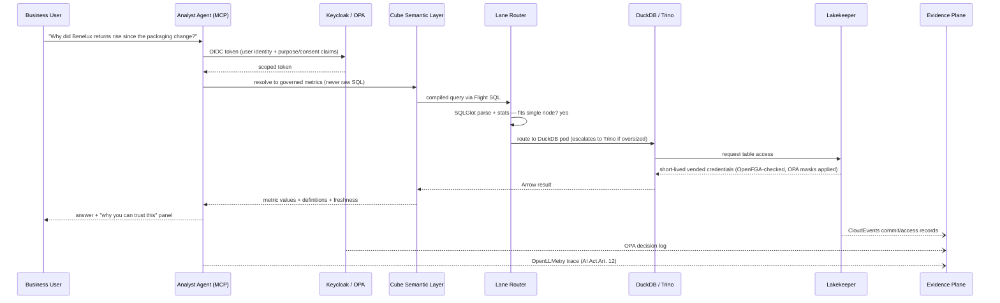

# CARINA Architecture

This document describes the full CARINA architecture: the layered design, the seven planes, the deliberately small set of connective protocols that make the parts compose, and one end-to-end flow. Component-level rationale lives in [components.md](components.md); the decisions behind the biggest choices are recorded as [ADRs](adr/).

---

## 1. Design Principles

1. **The contract is the keel.** No contract, no deployment. Everything compiles from ODCS 3.1 + ODPS 1.0; bespoke glue code is a design failure.
2. **Specs over glue; protocols over engines.** Iceberg REST Catalog, Arrow/ADBC/Flight SQL, Spark Connect, Substrait, OpenLineage, CloudEvents, OTLP, OIDC, SPIFFE, MCP. Engines are replaceable behind seams.
3. **Agents are the fifth persona.** Same identity plane, same policies, same masks, same audit trail as humans. No parallel access path exists, structurally.
4. **Rust/Go data planes; JVM only where irreplaceable.** Scale-to-zero economics punish five-minute warm-ups.
5. **Sovereignty as architecture.** The infrastructure contract is "any S3 API + any CNCF Kubernetes." Assume the Data Privacy Framework falls.
6. **Evidence by construction.** Trust is rendered as UX ("why you can trust this") and stored as hash-chained tables.
7. **Nobody chooses an engine.** Lane escalation is a routing component, invisible to users and agents alike.
8. **Boring connective tissue, exciting composition.** The connecting parts are few: IRC, Arrow, OIDC/SPIFFE, YAML specs, OTel.
9. **Every claim of joy has a number.** Time-to-value is a tracked platform SLO.

---

## 2. The Contract Compiler — CARINA's Hub

The single most important mechanism in CARINA is not an engine but a **compilation pipeline**. Every data product is declared by two Git-versioned files:

- an **ODCS 3.1 data contract** (schema, classifications, quality SLOs, retention, owners, purposes, output ports), and
- an **ODPS 1.0 data-product descriptor** (the product around the contract: description, tier, consumers, pricing/chargeback tags).

From these, CI compiles — never a human hand-writes —

| Compiled artifact | Consumed by |
|---|---|
| Soda Core checks + SQLMesh audits | Quality gates, Elementary anomaly baselines |
| DDL (Iceberg v3 tables) | Lakekeeper / engines |
| Schema-registry entries, enforced broker-side at write | AutoMQ / producers |
| OPA row/column/purpose masks (generated Rego) | Every query path, human or agent |
| OpenFGA relationship tuples | Catalog-level access decisions |
| Catalog metadata + lineage registration | OpenMetadata |
| Retention, tiering, snapshot-expiry schedules | Ceph lifecycle, Amoro, Lakekeeper |
| Semantic-model stubs (MetricFlow YAML) | Cube semantic layer |
| Incident routing (from the `owner` field) | GoAlert |
| Marketplace product page + status page | Data Product Portal |

Where ODAP had a custom OpenMetadata→Keycloak→OPA bridge, CARINA has this compiler. It is governance, self-service, and documentation collapsed into a single Git workflow: **one commit updates checks, masks, DDL, catalog, marketplace, and agent grounding**, and Argo CD reconciles the world to it.

---

## 3. The Layers

### Storage & Table Layer

- **Rook-Ceph (RGW/S3)** is production object storage — battle-tested, LGPL, CNCF-orchestrated, petabyte-proven self-hosted S3 (MinIO's open-source edition was archived in April 2026; see [ADR-0003](adr/ADR-0003-object-storage.md)). **Garage** serves the laptop/edge profile. EU-provider S3 (StackIT, OVHcloud, Scaleway) plugs in unchanged because the platform contract is only "S3 API + Iceberg REST Catalog."
- **Apache Iceberg v3** on Parquet is the canonical table format: deletion vectors, row lineage, the VARIANT type; the announced v4/Delta convergence de-risks the bet ([ADR-0001](adr/ADR-0001-table-format.md)).
- **Lance** is the AI-native second format for embeddings, documents, and training data — co-located on the same buckets, cataloged beside Iceberg, governed by the same contracts.
- **Apache Amoro** runs continuous compaction from day 1. Streaming-born small files are the #1 lakehouse failure mode; the maintenance tax is budgeted up front.
- Ceph pools implement three storage tiers — **hot** (NVMe, replicated), **warm** (HDD, erasure-coded), **cold** (EC + compression, RGW lifecycle transition). Every table's tier transitions, retention, and snapshot-expiry schedule are **compiled from the `retention` and `slaProperties` fields of its contract**. Lifecycle is governance output, not an ops afterthought.

### Catalog & Control Point

- **Lakekeeper** (Rust, Iceberg REST Catalog) is the **data control plane**: credential vending (no engine, human, or agent ever holds storage keys), multi-table commits, built-in OpenFGA authorization plus the OPA bridge for Trino, and exactly-once CloudEvents emission feeding the evidence plane ([ADR-0002](adr/ADR-0002-catalog.md)).
- **Apache Polaris** is the documented fallback — and the fallback is *operational*: a quarterly, CI-tested Lakekeeper→Polaris migration drill runs against a snapshot of production metadata.
- Lakekeeper's **CloudNativePG**-managed Postgres is the platform's crown jewels and is protected with the strictest DR tier (RPO ≤ 5 min; see [governance-and-sovereignty.md](governance-and-sovereignty.md#8-disaster-recovery--backup)).
- **OpenMetadata** (1.13+) is the **business/context catalog** — discovery, column-level lineage, glossary, quality surfacing, and agent grounding via its built-in MCP server. It informs; it never enforces. Enforcement lives at Lakekeeper/OPA/OpenFGA.

### Compute & Query Layer — four lanes, one substrate, one front door

All lanes mount the same Lakekeeper endpoint and speak Arrow ([ADR-0004](adr/ADR-0004-compute-lanes.md)):

| Lane | Engine | Purpose |
|---|---|---|
| 1 | **DuckDB fleet** (ephemeral pods, embedded, DuckDB-Wasm) | The default interactive experience; scale-to-zero by construction |
| 2 | **Trino** (one contained, autoscaled cluster) | Governed federation and OPA-heavy ad-hoc |
| 3 | **Spark Connect endpoint** → Spark 4.x + Gluten/Velox (with **LakeSail Sail** piloted behind the same URL) | Heavy ETL; the engine is a URL, not a commitment |
| 4 | **StarRocks** | JOIN-heavy, sub-second, high-concurrency serving directly on Iceberg |

Python/AI dataframes run **Polars** and **Daft-on-Ray**, fronted by **Ibis** so code written against DuckDB retargets distributed engines unchanged.

In front of everything sits the **Lane Router** — a small bespoke service on the Flight SQL front door. It uses SQLGlot parsing, table statistics from Lakekeeper, and historical query telemetry from ClickStack to route each query DuckDB → Trino → StarRocks/Spark transparently. **No user, notebook, dashboard, or agent ever selects an engine.** Escalation is an explicit, observable routing decision with its own OpenTelemetry span.

The silent risk of a multi-engine spine is SQL dialect drift. The **Cross-Lane Conformance Suite** — a canonical query corpus with cell-level result diffing across all four lanes — runs nightly and gates every engine and SQLGlot upgrade.

### Ingestion & Motion Layer

Three governed on-ramps, one off-ramp ([ADR-0006](adr/ADR-0006-streaming-spine.md)):

1. **CDC / streaming:** **Debezium** → **AutoMQ** (Kafka protocol, S3-native, diskless; **Table Topics** materialize streams into Iceberg in-broker — no separate copy job). **RisingWave** is the default SQL streaming / incremental-view-maintenance tier (Postgres wire protocol); **Flink 2.x** is retained for heavyweight CEP and whole-database sync. A Confluent-compatible schema registry enforces contract schemas **broker-side at write** — contracts enforced where enforcement is cheapest.
2. **SaaS / API batch:** **dlt** covers the long tail of SaaS sources (Salesforce, Stripe, GA4, HubSpot, and hundreds more via its REST API toolkit). dlt pipelines are scaffolded directly into the golden path (`carina create data-product --source salesforce`), run as Dagster assets, and land in Iceberg through the same catalog with the same contracts.
3. **Files:** object-store drop zones with contract validation on landing.

The off-ramp — **reverse ETL / activation** — is **Multiwoven** (open-source reverse ETL; AGPL, deployed as an isolated service). It syncs governed, contract-declared **output ports** back to CRMs, ad platforms, and operational systems. OPA masks apply on the way out exactly as on the way in; every synced row is evidence-logged.

### Transformation & Quality Layer

- **SQLMesh** (Linux Foundation) with dbt-project compatibility: virtual data environments give per-PR environments and blue-green promotion for free ([ADR-0005](adr/ADR-0005-transformation.md)).
- **SQLGlot** is the platform-wide SQL intermediate representation — parsing, transpilation, column-level lineage, conformance checking.
- **Recce** provides merge-blocking lineage + data diffs on every PR; **Write-Audit-Publish** runs on Iceberg branches.
- Quality checks are **Soda Core** checks and SQLMesh audits *compiled from the contract* via datacontract-cli — never handwritten. **Elementary** provides ML anomaly detection on freshness and volume as the incident sensor layer.

### Orchestration

**Dagster** (asset-oriented; Components + `dg` CLI; ships an MCP server) orchestrates data products. **Kestra** handles event-driven platform automation. Airflow is retired ([ADR-0007](adr/ADR-0007-orchestration.md)).

### Semantic Layer

**Cube** (OSS core) serves metrics to humans and agents over MCP, Postgres-wire SQL, and REST/GraphQL. Definitions are authored as **MetricFlow** YAML (Apache 2.0) with **Open Semantic Interchange (OSI)** as the interchange format. Metrics carry explicit versions with deprecation windows and consumer notification (see [governance-and-sovereignty.md](governance-and-sovereignty.md#6-semantic-change-management)). This layer is load-bearing: **it is the only AI interface to data** ([ADR-0008](adr/ADR-0008-semantic-layer-ai-grounding.md)).

### AI-Native Layer

- **MCP on every service**, published to a **private MCP registry** with per-tool approval tiers; **Keycloak** is the OAuth authorization server for agents (client-ID metadata documents, incremental scopes).
- Inference: **vLLM + llm-d + KServe** (`LLMInferenceService`), scheduled by **Kueue/DRA**; default weights from the **Mistral 3 series** (Apache 2.0), with Apertus/EuroLLM for EU languages, and frontier APIs as a policy-gated tier by data classification.
- Agent runtime: **LangGraph** (durable, auditable) with Pydantic AI for simple typed tools.
- Vectors: **Lance** is the system of record; **Qdrant** is the latency tier.
- AI observability: **OpenLLMetry → Langfuse** (self-hosted); **MLflow 3** for model registry and evals; **Feast** for features.

On this substrate ship the three product agents — **Analyst**, **Engineer**, **Steward** — detailed in [ai-native.md](ai-native.md).

### Governance & Trust Layer

**Keycloak** (humans + agents) ⊕ **SPIFFE/SPIRE** (workload SVIDs, hourly rotation) ⊕ **OpenFGA** (ReBAC at the catalog) ⊕ **OPA** (row/column/purpose decisions, Rego *generated* from contract classification tags). Consent and purpose ride as OIDC token claims evaluated at query time — the same mask applies to an analyst and to an agent's MCP tool call ([ADR-0009](adr/ADR-0009-identity-policy-fabric.md)).

The **evidence plane** — the one large bespoke build, honestly budgeted at roughly 4 engineer-years across Phases 2–3 — flows Lakekeeper CloudEvents, OPA decision logs, and OpenTelemetry into **append-only, hash-chained (Merkle) Iceberg audit tables** with ≥ 6-month retention ([ADR-0010](adr/ADR-0010-evidence-plane.md)). GDPR erasure is an SLO'd platform operation with lineage-driven propagation and a signed completion certificate. PETs: **OpenDP / Tumult Analytics** for differentially private outputs; **SDV / MOSTLY AI SDK** powering the **synthetic-data twin** offered instantly while sensitive-access approval is pending. Confidential tier: Confidential Containers.

### Experience Layer

- **Backstage** — golden-path templates, versioned TechDocs, runbooks — for engineers.
- **Data Product Portal** (Dataminded) — the business marketplace with self-service, policy-decided access and per-product **status pages**.
- **marimo** reactive notebooks; **Rill** for exploratory BI-as-code; **Evidence** for narrative data products; **Superset** retained on demand; **Quarto** for publishing.
- The **`carina` CLI** wraps it all; **Delta-Sharing-compatible open sharing + Arrow Flight SQL** for cross-organization data sharing.
- One login, no iframes: surfaces compose through shared specs and SSO or they don't ship.

### Infrastructure & Operations Layer

- **Argo CD (+ Rollouts)** is the **only write path to production**; **Crossplane** exposes "give me a data-product workspace" as a namespaced Kubernetes API; **vCluster** provides tenant and agent sandboxes.
- **Kueue + Dynamic Resource Allocation + Karpenter** run compute spot-first with fair sharing; **KEDA** everywhere — including a ~200-line carbon-aware scaling pattern owned in-repo (no dependency on stale operators).
- **CloudNativePG** manages every Postgres; **External Secrets Operator + OpenBao** manage secrets; **Stackable** operators are used where they fit.
- Observability: **OpenTelemetry + eBPF instrumentation → ClickStack** (ClickHouse + HyperDX) — one SQL-queryable columnar signal store that the platform's own query lanes can read.
- FinOps/GreenOps: **OpenCost + Kepler** land cost-per-query and gCO₂-per-pipeline **as semantic-layer metrics**, queryable like any business metric.

---

## 4. Connective Tissue — deliberately few, deliberately boring

1. **Iceberg REST Catalog (Lakekeeper)** — every engine, streaming writer, and sharing endpoint mounts one catalog; credential vending makes it border control, not a phonebook.
2. **Arrow / ADBC / Flight SQL / Substrait / Spark Connect** — zero-copy data plane and engine-swap seams; JDBC/ODBC exist only as generated shims.
3. **One identity fabric: Keycloak OIDC ⊕ SPIFFE ⊕ OpenFGA/OPA** — humans, workloads, agents: same principals, same policies, same audit.
4. **Spec artifacts in Git: ODCS + ODPS + MetricFlow/OSI YAML + Kubernetes CRs** — one commit updates checks, masks, DDL, catalog, marketplace, and agent grounding; Argo CD reconciles.
5. **CloudEvents + OpenLineage + OTLP + MCP** — one nervous system into ClickStack, OpenMetadata, and the hash-chained audit tables.

Everything else is replaceable. These five are the platform.

---

## 5. The Seven Planes

### 1. Data Plane
Rook-Ceph/Garage, Iceberg v3 + Lance, Lakekeeper, Amoro.
**Responsibility:** durable, tiered, governed storage of every table and artifact; credential vending; lifecycle compiled from contracts.
**Interfaces out:** IRC to every engine; CloudEvents to the Trust Plane; storage metrics to Operations.

### 2. Compute Plane
Lane Router, DuckDB, Trino, StarRocks, Spark Connect (Spark/Sail), Polars/Daft/Ibis.
**Responsibility:** execute every query and transformation; escalate lanes invisibly.
**Interfaces:** mounts only the Data Plane's IRC endpoint (never raw keys); Arrow/Flight SQL up to Intelligence and Experience; OTel spans to Operations.

### 3. Motion Plane
dlt, Debezium, AutoMQ, RisingWave, Flink, Multiwoven, Dagster/Kestra schedules.
**Responsibility:** everything entering or leaving — SaaS EL, CDC, streams, files, reverse ETL.
**Interfaces:** schema-registry enforcement at write; lands only through Lakekeeper; activation reads only contract-declared output ports with OPA masks applied.

### 4. Intelligence Plane
Cube semantic layer, MetricFlow/OSI definitions, the three product agents, MCP registry, vLLM/KServe inference, Qdrant, MLflow/Langfuse.
**Responsibility:** meaning and reasoning; the only AI path to data.
**Interfaces:** consumes Compute via Flight SQL only through Cube; consumes context from OpenMetadata's MCP server; all tool calls carry Trust Plane tokens.

### 5. Trust Plane
Keycloak, SPIRE, OpenFGA, OPA, the contract compiler, evidence plane, erasure service, synthetic-data service, PETs.
**Responsibility:** identity, policy, consent/purpose claims, audit, erasure, and the compilation pipeline from contract to enforcement.
**Interfaces:** tokens and SVIDs into every plane; decision logs and CloudEvents into hash-chained Iceberg tables readable by the Compute Plane itself.

### 6. Experience Plane
Backstage, Data Product Portal (with status pages), `carina` CLI, marimo, Rill, Evidence, Superset, Quarto, the Analyst chat surface.
**Responsibility:** one login, one portal per persona, golden paths, docs and enablement as a product (versioned TechDocs per release train, runbooks beside components, the Carina Academy curriculum, an in-repo RFC process).
**Interfaces:** rendered from the same ODPS/ODCS/metric YAML; SSO everywhere; no iframes.

### 7. Operations Plane
Argo CD/Rollouts, Crossplane, vCluster, Kueue/Karpenter/KEDA, CloudNativePG, ESO/OpenBao, OTel/ClickStack, OpenCost/Kepler, GoAlert, LitmusChaos, DR machinery.
**Responsibility:** the platform runs, scales, costs, recovers, and upgrades itself — with agents filing the PRs and humans (or auto-merge classes) approving them.
**Interfaces:** Git is the only write path; every other plane is its reconciliation target.

---

## 6. End-to-End Flow: a business question

Femke (business user) asks: *"Why did Benelux returns rise since the packaging change?"*

Every hop in this flow is governed by the same mechanisms: the token carries purpose, the catalog vends scoped credentials, the mask is generated from the contract, and the whole interaction lands in the evidence plane. There is no privileged side door — not for admins, not for agents.

---

## 7. Deployment Profiles

| Profile | Target | Scope |
|---|---|---|
| **Sloop** | Small org / single team; 3 nodes, ~64 vCPU / 256 GB / 20 TB; a 3-person team | ~20 components: Garage or single-site Ceph, Lakekeeper, DuckDB + small Trino, Dagster, SQLMesh, dlt, Cube, Keycloak/OpenFGA/OPA, OpenMetadata, Backstage-lite, Argo CD, OTel/ClickStack. Deliberately excludes StarRocks, Flink, GPU serving, vCluster. |
| **Clipper** | Full platform | Everything in this document; operated by 6–8 platform FTE (2 infra SRE, 2 data platform, 1 governance engineer, 1 DX/enablement, + rotation), one-week on-call where agents file the first PR before paging. |
| **Laptop** | Development | k3d + Garage, full-fidelity local profile; `carina run` builds any production project locally on DuckDB in seconds. |

Minimalism is a supported product, not a degraded one.
