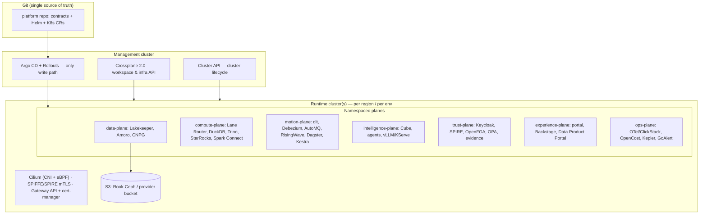

# CARINA Implementation & Deployment Plan

**From the laptop reference implementation to an enterprise-ready, cloud-agnostic, Kubernetes-native platform.**

This document is the *engineering delivery* view. Where [roadmap.md](roadmap.md) says **what** ships and **when** at the product level (KEEL → SAILS → CREW → HORIZON), this plan says **how** you build and operate it — the concrete workstreams, the Kubernetes architecture, the enterprise-readiness bars, and the path that starts from the code already in this repository.

It is deliberately written so a platform team can pick it up and execute. Every component references the [architecture](architecture.md), the [component registry](components.md), and the [ADRs](adr/).

---

## 0. Where we start, and what "the rest" is

The [reference implementation](../src/carina) (the `carina` laptop profile) already proves the platform's **spine**: the data contract is the hub artifact, quality is compiled from contracts, every action is hash-chained into an evidence log, and all consumption goes through a governed semantic layer with per-answer provenance. That is the hard conceptual core, working end to end.

"The rest" is turning each deliberate laptop-profile **shim** into its production component, and adding the cross-cutting layers an enterprise requires (identity, HA, DR, multi-tenancy, supply-chain security, SRE). The single most useful framing of this whole plan is the **shim → production** map:

| Concern | Laptop profile (today) | Production target | How it's deployed |
|---|---|---|---|
| Object storage | DuckDB file + local bronze JSON | Rook-Ceph (S1) / provider S3 (S2) / Garage (edge) | Rook operator or provider bucket; contract = "any S3 API" |
| Table format | DuckDB native tables | Apache Iceberg v3 on Parquet (+ Lance for AI) | Written via the catalog; Amoro compaction CronJobs |
| Catalog / control point | *(none — direct DuckDB)* | **Lakekeeper** (Iceberg REST Catalog) + CloudNativePG | Helm + CNPG operator; credential vending |
| Compute | Single embedded DuckDB | Four lanes behind the **Lane Router**: DuckDB fleet, Trino, StarRocks, Spark Connect | Deployments/KEDA; Stackable operators for Trino/Spark |
| Ingestion | `httpx` CBS client, synchronous | **dlt** (SaaS/API) + **Debezium → AutoMQ** (CDC/stream) | Dagster-scheduled jobs; AutoMQ + Strimzi-style operator |
| Contract compiler | Python: YAML → DDL + checks | Same concept, extended: also emits OPA Rego, OpenFGA tuples, schema-registry entries, Ceph lifecycle | CI job (datacontract-cli) writing to Git |
| Quality | In-process SQL checks | **Soda Core** + SQLMesh audits + **Elementary** anomaly detection | Dagster asset checks; Elementary on a schedule |
| Transformation | Product `*.sql` run directly | **SQLMesh** virtual envs + **Recce** diffs + WAP on Iceberg branches | SQLMesh in CI + Dagster |
| Orchestration | `carina run` CLI | **Dagster** (assets) + **Kestra** (event automation) | Dagster + Kestra Helm; MCP servers exposed |
| Semantic layer | `metrics.yaml` → compiled SQL | **Cube** + MetricFlow, served over SQL / REST / MCP | Cube Helm; the only consumption path |
| Evidence plane | In-process SHA-256 chain in DuckDB | Hash-chained (Merkle) **Iceberg audit tables** fed by Lakekeeper CloudEvents + OPA logs + OTel | Streaming sink + periodic Merkle anchoring job |
| Identity & policy | *(open API — no auth)* | **Keycloak** OIDC + **SPIFFE/SPIRE** + **OpenFGA** + **OPA** (generated Rego) | Keycloak + SPIRE + OpenFGA Helm; OPA sidecars/`opa-envoy` |
| Prepared analysis | Deterministic Python | **Analyst / Engineer / Steward** agents on LangGraph + MCP + vLLM/KServe | KServe `LLMInferenceService`; agents as Deployments |
| Experience | Static SPA served by FastAPI | Same portal + **Backstage** + **Data Product Portal** + Rill/Evidence/marimo | Per-surface Helm; one SSO; no iframes |
| Serving API | FastAPI single process | Hardened API behind ingress, authn/authz, HA replicas (or folded into Cube + catalog APIs) | Deployment + HPA + Gateway API |
| Observability | *(none)* | **OpenTelemetry + eBPF → ClickStack** (ClickHouse + HyperDX) | OTel Collector DaemonSet; ClickStack Helm |
| Delivery | `uvicorn` / `pip install` | **Helm/OCI charts**, **Argo CD** GitOps, **Crossplane** workspace API | Argo CD is the only write path to prod |

The rest of this document is the plan to walk that table from left to right, safely, in an order that is deployable at every step.

---

## 1. Target topologies — one platform, three sizes, any cloud

CARINA is deployable at three sizes; pick the smallest that meets the requirement and grow in place. These correspond to the profiles in [architecture.md §7](architecture.md#7-deployment-profiles) and the sovereignty tiers in [governance-and-sovereignty.md §7](governance-and-sovereignty.md#7-sovereignty-tiers).

| Profile | Who it's for | Footprint | What's excluded |
|---|---|---|---|
| **Sloop** | A single team / small org; a first production install | 3 nodes, ~64 vCPU / 256 GB / 20 TB, ~20 components | StarRocks, Flink, GPU serving, vCluster |
| **Clipper** | Full multi-tenant enterprise platform | Autoscaled node pools across ≥ 3 AZs; the full component set | — |
| **Laptop / CI** | Development + ephemeral PR envs | k3d + Garage, full-fidelity | Nothing conceptually; single-node scale |

**"Any cloud" is a contract, not a port.** The platform depends only on **(1) any S3-compatible object store and (2) any CNCF-conformant Kubernetes**. Everything else runs *inside* the cluster from OCI images, so moving clouds means changing two endpoints and a storage class — not re-architecting. Per-cloud specifics are in [Appendix A](#appendix-a--per-cloud-notes).

The three **sovereignty tiers** decide *which* substrate:

- **S1 Sovereign** — EU provider or on-prem; Rook-Ceph or EU S3; **all inference in-cluster** (open weights). Zero US-jurisdiction dependencies.
- **S2 Hybrid** — hyperscaler infra, open formats, **no proprietary control-plane** lock-in; frontier LLM APIs policy-gated by data classification.
- **S3 Laptop/edge** — k3d + Garage.

---

## 2. Reference Kubernetes architecture



**Principles that shape the cluster:**

- **One write path.** Humans and agents change production only by merging Git; **Argo CD** reconciles. `kubectl apply` to prod is a break-glass event, logged to the evidence plane.
- **Namespaced planes.** Each of the [seven planes](architecture.md#5-the-seven-planes) is one or more namespaces with its own NetworkPolicies, quotas, and RBAC. The plane boundary is a security boundary.
- **A management cluster** runs Argo CD, Crossplane, and Cluster API; it provisions and reconciles the **runtime clusters** (one per region and per environment). This keeps the control plane's blast radius separate from workloads.
- **Cilium** provides the CNI, eBPF network policy, and Hubble flow visibility (which doubles as an observability source); **SPIFFE/SPIRE** issues workload identities and mTLS; **Gateway API** (Envoy Gateway) + **cert-manager** terminate TLS at the edge.
- **Operators over bespoke YAML** wherever a mature one exists: Rook (Ceph), CloudNativePG (Postgres), Stackable (Trino/Spark/OPA), Strimzi-style (Kafka/AutoMQ), KServe (inference).

### GitOps repository layout

```
platform/
  clusters/            # one dir per cluster (mgmt, prod-eu-1, staging, …)
    <cluster>/apps/    # Argo CD Applications (app-of-apps)
  planes/              # Helm values per plane, per environment overlay
  crossplane/          # XRDs + Compositions: "give me a data-product workspace"
products/              # ODCS/ODPS contracts + transforms + semantic (as today)
charts/                # OCI Helm charts for CARINA-authored components
policies/              # OPA/Kyverno cluster policies, generated Rego (compiled)
```

Config is environment-overlaid (Helm values or Kustomize), promoted dev → staging → prod by PR. **Nothing about prod exists outside this repo.**

---

## 3. Cross-cutting enterprise-readiness workstreams

These run in parallel with the component build-out; each is a standing capability with an owner, not a one-time task.

### 3.1 Security & supply chain
- **SSO everywhere** via Keycloak OIDC; no component ships with its own local login enabled. SCIM/LDAP federation to the customer IdP.
- **Zero-trust workload identity**: SPIFFE/SPIRE SVIDs (hourly rotation), mTLS between all services (Cilium/mesh), default-deny NetworkPolicies per plane.
- **Authorization**: OpenFGA (ReBAC at the catalog) + OPA (row/column/purpose, Rego *generated* from contracts). Cluster RBAC least-privilege; no `cluster-admin` in workload namespaces.
- **Secrets**: External Secrets Operator + OpenBao; no secrets in Git (sealed/external refs only); automatic rotation.
- **Supply chain**: every image built in CI is SBOM'd (**syft**), scanned (**trivy/grype**), and **signed (cosign/sigstore)**; admission control (Kyverno) rejects unsigned or critical-CVE images; base images pinned by digest.
- **Runtime**: Pod Security Standards (restricted), read-only rootfs, non-root, seccomp; runtime threat detection (Falco/Tetragon) feeding the evidence/observability plane.
- **Program**: quarterly third-party pen test; a documented vulnerability-disclosure and CVE-response SLA.

### 3.2 Multi-tenancy & isolation
- **Soft isolation** (default): namespace-per-tenant with ResourceQuota, LimitRange, NetworkPolicy, and OPA/Kyverno guardrails; per-tenant Lakekeeper **warehouses** and OpenFGA stores.
- **Hard isolation** (regulated tenants / agent sandboxes): **vCluster** — a full virtual control plane per tenant.
- **Data isolation**: catalog-level credential vending means a tenant's engines only ever receive scoped, short-lived credentials to their own tables.
- **Cost isolation**: OpenCost attributes spend per namespace/tenant/query lane for chargeback (tags from the ODPS descriptor).

### 3.3 High availability & resilience
- Multi-AZ node pools (≥ 3 AZs); PodDisruptionBudgets and anti-affinity on every stateful and singleton service.
- CloudNativePG with **synchronous replicas** for all control-plane Postgres (Lakekeeper, Keycloak, OpenMetadata, Dagster, OpenFGA).
- Autoscaling: **Karpenter** (nodes, spot-first) + **KEDA/HPA** (pods, scale-to-zero for idle lanes) + **Kueue/DRA** (fair-share, GPU).
- Stateless services ≥ 2 replicas; graceful shutdown and readiness gates so rollouts never drop requests.

### 3.4 Disaster recovery & backup
Implements the DR tiers in [governance-and-sovereignty.md §8](governance-and-sovereignty.md#8-disaster-recovery--backup):

| Tier | Scope | Mechanism | RPO / RTO |
|---|---|---|---|
| 0 | Control-plane Postgres (Lakekeeper = crown jewels, Keycloak, …) | CNPG sync replicas + WAL archiving (barman-cloud) to a separate zone; 30-day PITR | ≤ 5 min / ≤ 30 min |
| 1 | Contracted gold/silver Iceberg products | Ceph RGW multisite / cross-bucket replication | ≤ 15 min / ≤ 4 h |
| 2 | Bronze/raw + AutoMQ segments | Async replication; re-ingestable sources documented | ≤ 1 h / ≤ 24 h |
| 3 | Scratch/dev | none | — |

**Doctrine:** Iceberg snapshots are *not* backups (same bucket). True backup = cross-site replication + a catalog PITR consistency point. **Drills are scheduled**: monthly Tier-0 restore, quarterly full DR game day, quarterly Lakekeeper→Polaris migration drill — each publishes an RTO scorecard. A backup never restored is a hypothesis, not a control.

### 3.5 Observability & SRE
- **OpenTelemetry + eBPF → ClickStack** (ClickHouse + HyperDX): one SQL-queryable store for logs, metrics, traces — the platform's own lanes can query it.
- **SLOs** on every user-facing capability *and* on the joy metrics (data-product-to-live time, query latency, answer latency), with error budgets. Alerting → **GoAlert**, routed from the contract `owner` field.
- **Runbooks** live beside components (Backstage TechDocs); on-call is one-week rotation where **the Engineer agent files the first remediation PR before a human is paged**.

### 3.6 Governance & compliance (already the product)
- The **evidence plane** turns GDPR/NIS2/AI-Act/SOC 2/ISO 27001 evidence into standing queries (hash-chained Iceberg audit tables). Map each control framework to the evidence query that proves it; give auditors a read-scoped account, not a project.
- **GDPR erasure** as an SLO'd operation (`carina erase --subject`) with lineage-driven propagation and a signed completion certificate.
- **AI Act**: OpenLLMetry traces (Art. 12) + training-data lineage (Art. 10) + the "why you can trust this" panel on every AI answer.
- Pursue **SOC 2 Type II / ISO 27001** certification against these controls in the CREW/HORIZON phases.

### 3.7 Data quality, testing & release safety
- **Cross-Lane Conformance Suite**: a canonical query corpus, cell-level diffed across DuckDB/Trino/StarRocks/Spark nightly and on every engine/SQLGlot upgrade (the spine's biggest silent risk — see [ADR-0004](adr/ADR-0004-compute-lanes.md)).
- **WAP on Iceberg branches** + **Recce** merge-blocking data diffs on every product PR.
- **Chaos** (LitmusChaos) and **performance-regression** gates (TPC-DS-derived + production-query replay) via Argo Rollouts shadow replay before any engine version is promoted.

### 3.8 FinOps & GreenOps
- **OpenCost + Kepler** land cost-per-query and gCO₂-per-pipeline as *semantic-layer metrics* — queryable next to business metrics, renderable on product pages.
- Karpenter spot-first, KEDA scale-to-zero, carbon-aware batch windows (the ~200-line in-repo KEDA pattern). Agents propose right-sizing as quantified PRs.

---

## 4. CI/CD & release engineering

- **Source**: this GitHub repo (mono-repo for platform + charts + products; product teams may have satellite repos that publish contracts).
- **Build**: GitHub Actions → OCI images (multi-arch), SBOM, scan, sign; Helm charts published as **OCI artifacts** to the registry.
- **Deploy**: **Argo CD app-of-apps** per cluster; environments **dev → staging → prod** promoted by PR with required checks (datacontract-cli contract gate, unit/integration, conformance smoke, policy validation).
- **Progressive delivery**: **Argo Rollouts** (canary + shadow-replay) for compute-engine and API changes; automated rollback on SLO breach.
- **Ephemeral environments**: every product PR spins a **vCluster** preview with a scoped data slice, torn down on merge — the "laptop parity in CI" promise.
- **Versioning**: platform components pinned per release train; a documented upgrade runbook per component; nothing floats on `latest`.

---

## 5. Delivery plan — phased, deployable at every step

Each phase is **independently deployable and valuable**; you never have a half-built cluster that does nothing. Phase 0 is new to this plan (it productionizes the code that exists today); Phases 1–4 map to the product [roadmap](roadmap.md) KEEL/SAILS/CREW/HORIZON.

### Phase 0 — Deployable MVP (weeks 0–6): "the demo, but on a cluster, with a login"
Turn the reference implementation into a real, if minimal, K8s service — the smallest thing that is genuinely deployable and secured.
- Containerize `carina` (API + UI); Helm chart; deploy to a managed cluster (any cloud) and to k3d.
- Move state off the DuckDB file: **CloudNativePG** for metadata; **provider S3 (or Rook-Ceph)** for object storage; DuckDB reads Parquet/Iceberg on S3 instead of a local file.
- **Keycloak SSO** in front of the portal and API; Gateway API + cert-manager TLS; default-deny NetworkPolicies.
- **Argo CD** managing the whole thing from Git; **OTel → ClickStack** wired.
- **Definition of done:** the labour-market app runs on a cloud cluster behind SSO, deployed only via Git merge, with metrics/logs/traces flowing and a Tier-0 Postgres backup taken. *This is your first "deploy on any cloud" milestone.*

### Phase 1 — KEEL (months ~1.5–6): the lakehouse spine
Swap the storage/catalog/compute shims for the real spine. Scope, DoD, and the ODAP-style migration mechanics are in [roadmap.md → KEEL](roadmap.md#phase-1--keel-months-05-the-spine-and-the-golden-path): Rook-Ceph/Garage, **Lakekeeper** + Iceberg v3, DuckDB + Trino lanes with the **Lane Router**, SQLMesh + SQLGlot + Recce + WAP, Dagster, dlt ingestion, the contract compiler emitting masks/tuples/DDL, the full identity fabric (Keycloak + SPIFFE + OpenFGA + generated OPA), Backstage + `carina` CLI.
- **DoD (engineering):** a new data product ships end-to-end in < 60 min, measured; the reference app's tables are Iceberg-on-Lakekeeper with row-level parity; Tier-0 restore drill passed; conformance suite running nightly.

### Phase 2 — SAILS (months ~6–10): motion, semantics, experience
Streaming becomes the default on-ramp and the semantic/experience layers land. Per [roadmap.md → SAILS](roadmap.md#phase-2--sails-months-510-motion-semantics-experience): Debezium → **AutoMQ** Table Topics + **RisingWave** + Amoro; **StarRocks** serving lane; **Cube** + MetricFlow with the metric-versioning workflow; Rill/Evidence/marimo + Data Product Portal with status pages; **Multiwoven** reverse ETL; **evidence plane v1** (hash-chained audit tables); incident lifecycle live.
- **DoD:** streaming is the default for new sources; one metric definition is identical across BI, SQL API, and chat; evidence plane serving standing compliance queries.

### Phase 3 — CREW (months ~10–16): the agents and the trust product
The AI-native layer and the trust differentiators. Per [roadmap.md → CREW](roadmap.md#phase-3--crew-months-1016-the-agents-and-the-trust-product): **Analyst / Engineer / Steward** agents GA with the private MCP registry and auto-merge classes; sovereign inference (**vLLM + llm-d + KServe**, open weights); the "why you can trust this" panel on every AI answer; **erasure as an SLO'd operation** with certificates; consent/purpose token claims end-to-end; synthetic-data twins; Splink golden records; chaos + DR game days operational.
- **DoD:** an erasure request completes within SLO with a certificate on 3+-hop lineage; the Engineer agent's first auto-merged and first human-approved fixes are in production; SOC 2 Type II audit window opened.

### Phase 4 — HORIZON (months ~16–24): scale, residency, certification
Multi-region and hardening for scale. Per [roadmap.md → HORIZON](roadmap.md#phase-4--horizon-months-1624-scale-residency-self-improvement): multi-region residency topology (per-region Lakekeeper, federated catalog metadata, residency-aware routing); confidential-computing tier; performance-regression gating every engine upgrade; **Sloop profile GA** (deployable from docs alone by a fresh team in < 1 week); the **Clipper operating model** documented and staffed.
- **DoD:** a second region serving residency-scoped products; SOC 2 / ISO 27001 certified; a Sloop install stood up by a team that didn't build it.

*Timelines assume a ~6–8-FTE platform team (see §7); they compress with more hands on independent workstreams and stretch on a smaller team — the phase **boundaries and exit criteria** are the fixed points, not the month numbers.*

---

## 6. Environments & promotion

| Environment | Substrate | Purpose | Data |
|---|---|---|---|
| **Laptop** | k3d + Garage | Dev inner loop; `carina run` parity | Synthetic / public open data |
| **PR preview** | vCluster in CI | Per-PR validation, Recce diffs | Scoped slice / synthetic twin |
| **Dev** | Small shared cluster | Integration | Non-prod |
| **Staging** | Prod-like, smaller | Release candidates, DR drills, load tests | Masked prod-shaped |
| **Prod** | Clipper (multi-AZ, per region) | The platform | Governed, contracted |

Promotion is a Git PR with required checks; **staging must be prod-shaped** (same charts, smaller replicas) so that "works in staging" means it.

---

## 7. Team & operating model

The **Clipper operating model** ([architecture.md §7](architecture.md#7-deployment-profiles)): **6–8 platform FTE** — 2 infra/SRE, 2 data-platform, 1 governance engineer, 1 DX/enablement, + on-call rotation — where the platform's own agents file the first PR before paging. **Sloop** can be run by **3 people**. Product/domain teams are *users* of the platform via golden paths, not part of the platform team. Build the enablement (Carina Academy, TechDocs, RFC process) as a first-class product from Phase 1 so the platform team doesn't become a ticket queue.

---

## 8. Build-vs-buy & managed services

The platform is open-source-first and portable by design, but you can trade sovereignty for operational load per tier:

| Layer | Self-managed (S1 sovereign) | Managed (S2 hybrid) — cuts ops |
|---|---|---|
| Kubernetes | Cluster API on bare metal / EU cloud | EKS / AKS / GKE |
| Object store | Rook-Ceph | S3 / GCS / Azure Blob-via-gateway |
| Postgres | CloudNativePG | CNPG still (portable) or provider RDS |
| Inference | vLLM/KServe on your GPUs | KServe on managed GPU, or policy-gated frontier APIs |
| Observability | Self-hosted ClickStack | ClickStack on managed ClickHouse |

The rule ([non-goals](risks-and-non-goals.md)): **no proprietary control-plane dependency** — a managed service is acceptable only where swapping it out is a config change, never a re-architecture. That is what keeps "any cloud" true.

---

## 9. Cost envelope (rough order-of-magnitude)

Indicative only — real cost depends on data volume, query concurrency, GPU use, and cloud/region.

| | Sloop | Clipper (starting) |
|---|---|---|
| Compute | ~3 nodes (~64 vCPU / 256 GB) | Autoscaled ≥ 3 AZs; spot-first via Karpenter |
| Storage | ~20 TB (single-site) | Tiered hot/warm/cold + cross-site replication |
| GPU | none | Kueue/DRA-scheduled pool for inference |
| Team | 3 people | 6–8 FTE |
| Rough infra $/mo | low-thousands | tens-of-thousands+, scaling with data/GPU |

FinOps is built in (OpenCost/Kepler as metrics), so cost is observable and attributable from day one rather than discovered on the invoice.

---

## 10. Risk register (delivery)

Extends the platform [bets](risks-and-non-goals.md) with execution risks.

| Risk | Mitigation |
|---|---|
| Scope: "build everything at once" | Phase 0 ships a deployable MVP in weeks; every phase is independently valuable |
| Lakekeeper is young and central | IRC spec makes migration a metadata move; quarterly CI-tested Polaris drills; Tier-0 PITR |
| Cross-lane SQL dialect drift corrupts answers silently | Cross-Lane Conformance Suite gates every engine/SQLGlot upgrade |
| Multi-cloud object storage friction (esp. Azure) | Standardize on the S3 contract; run Rook-Ceph or an S3 gateway where native S3 is absent ([Appendix A](#appendix-a--per-cloud-notes)) |
| Enterprise integration drag (SSO, RBAC, audit) | These are Phase-0/Phase-1 workstreams, not afterthoughts; SCIM/LDAP federation early |
| Team too small for the timeline | Phase boundaries/exit criteria are fixed; month numbers flex; Sloop is a supported smaller target |
| Agent autonomy vs. auditability | Agents act only via Git PRs; pre-approved auto-merge classes; noise budgets as SLOs |

---

## 11. Immediate next steps (first 2–4 weeks)

1. **Stand up the management cluster** (Argo CD + Crossplane + Cluster API) on the chosen substrate; wire this repo as the GitOps source.
2. **Containerize and chart `carina`** (API + UI); publish signed OCI image + Helm chart from GitHub Actions.
3. **Externalize state**: CloudNativePG for metadata; point object storage at provider S3 or a Rook-Ceph install; convert the reference tables to Iceberg-on-Lakekeeper (start of Phase 1) or keep Parquet-on-S3 for the Phase-0 MVP.
4. **Put Keycloak in front**: SSO on the portal + API; Gateway API + cert-manager TLS; default-deny NetworkPolicies.
5. **Wire OTel → ClickStack** and take the **first Tier-0 backup + restore drill**.
6. **Write the first Crossplane XRD** — "give me a data-product workspace" — so product onboarding is self-service from day one.

Completing these is Phase 0's Definition of Done: the platform, deployed on a cloud cluster, behind SSO, changed only through Git, observable, and backed up — the foundation every later phase builds on.

---

## Appendix A — Per-cloud notes

The platform contract is **"any S3 API + any CNCF Kubernetes."** Only these two endpoints and a storage class change between clouds.

| Cloud | Kubernetes | Object storage (the S3 endpoint) | Notes |
|---|---|---|---|
| **AWS** | EKS | Native **S3** (S2), or Rook-Ceph on EBS (S1) | Smoothest path; S3 is the reference S3 API |
| **GCP** | GKE | **GCS** via its S3-compatible XML API (HMAC keys) | Works with Iceberg S3 clients directly |
| **Azure** | AKS | **Rook-Ceph** or an S3 gateway in front of Blob | Azure Blob isn't natively S3; standardize via Ceph/gateway — the one real friction point, called out honestly |
| **EU sovereign** (StackIT, OVHcloud, Scaleway, Outscale) | Managed K8s or Cluster API | Provider S3-compatible object storage | The S1 path; SecNumCloud via Outscale |
| **On-prem / bare metal** | Cluster API + kubeadm | **Rook-Ceph** | Full sovereignty; needs ≥ 3 storage nodes |

Because the runtime is identical across all of these, a workload validated on one is validated on all — the conformance and DR drills are what certify a new substrate, not a re-port.

---

*This plan is executable as written, but its parameters — target cloud(s), team size, timeline, and sovereignty tier — shape the phasing and build-vs-buy calls. Treat the phase **exit criteria** as fixed and the calendar as negotiable.*
